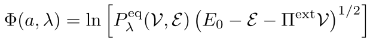

# MLConcaveEntropy
MLConcaveEntropy is a neural network designed to compute the entropy function of a system from the probabilities of the system being in the state characterized by the pair (E,V) as obtained from multiple simulations.

mail: a.vazquez-quesada@fisfun.uned.es

   
  <em>Evolution of the loss function during training for different neural networks.</em>

--------------------------------------------------

- Host variables and functions are declared in class_system.h.
  Each function is defined in its own file, specifically in system_* files.

- Device variables and functions are declared in kernel_functions.h.
  Each function is defined in its own file, specifically in kernel_* files.

- In config.h we can define if the real variables are float or double.

- main.cu is the main file of the code.

## Compilation 
The compilation is done with the makefile file. 
To compile, just write the following command in the command line:

make -j

The file MLConcaveEntropy will be created, which is the executable.

If you want to clean everthing before compiling again, just do

make clean

## Running the program

You need to have the following files in the same directory (with the exact names shown below):

- **MLConcaveEntropy**: the executable.
- **input**: a file containing the program inputs.
- **data1.dat**: First data file with the function Phi, obtained from the first simulation. Three columns: E, V, Phi. 
- **data2.dat**: Second data file with he function Phi, obtained from the second simulation. Three columns: E, V, Phi.
- ...
- **dataN.dat**: Nth data file with he function Phi, obtained from the Nth simulation. Three columns: E, V, Phi.

The calculation of the function Phi is obtained from the probability P(E,V) of the system to be in the state (E,V) as

   

To run the program, execute:

./MLConcaveEntropy

## Input Variables

**Nneurons**               -> Number of neurons per hidden layer

**Nhidden**                -> Number of hidden layers

**Niterations**            -> Number of iterations

**N_per_batch**            -> Number of data points per batch
                     
**initialization**         -> Initialization method for weights and biases. There are two options:

                             1.- Uniform random distribution in the interval (-epsilon, epsilon)
                      
                             2.- Xavier initialization

**epsilon**               -> Parameter used when initialization = 1

**eta**                   -> Learning rate of the neural network

**beta1**                 -> ADAM optimizer parameter for the gradient descent update

**beta2**                 -> ADAM optimizer parameter for the gradient descent update

**epsilon_adam**          -> ADAM optimizer parameter used for numerical stability

**Nfiles**                -> Number of files with probabilities of states (E,V). Each file will correspond to a different simulation.

**freq_loss_function**    -> Frequency (in iterations) at which the loss function value is written to the file `loss_function.dat`

**freq_gnu_file**         -> Frequency (in iterations) at which the file `approx_function-%d.gnu` is generated, where `%d` is the iteration number.  
                             This file is a gnuplot script used to plot the fitted function

**new_calculation**       -> Is this a new calculation, or is it continuing from a previous one?

                             0.- The calculation starts from scratch.
 
                             Non-zero.- The calculation starts from a previous run. In this case, you must use the last approx*.gnu file generate in the previous 
                             calculation and rename it as weights.gnu. This file must be located in the same directory as the input file for the calculation to run.

**steps_to_initialize**   -> The program does not save the variables of the ADAM method, so when a calculation is restarted, it is convenient to reduce the learning rate during 
                             the first steps of the calculation. This variable specifies the number of steps for which this reduction is applied.

**initial_reduction_eta** -> The factor by which the lerarning rate is reduced during the initial time steps when the calculation is restarted from a previous run.

## Data File

The file `data.dat` must contain three columns corresponding to the x-, y-, and z-coordinates of each data point.

## Output Files

**loss_function.dat** -> Two columns:

                      Column 1 -> Iteration

                      Column 2 -> Loss function value

**approx_function-%d.gnu**, where `%d` is the iteration number.

This is a script for the gnuplot program used to plot the function fitted by the neural network. To run it, simply execute:

  gnuplot approx_function-%d.gnu 
  
Every weight of the neural network can be extracted from the approx*.gnu files.
